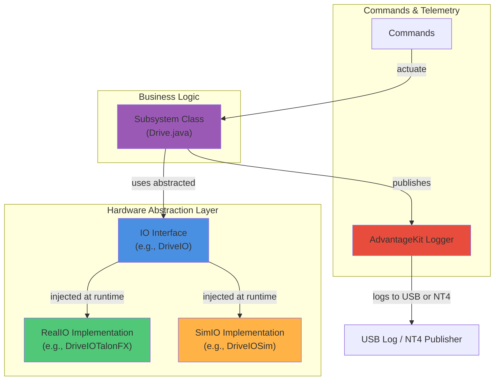

# FRC 2026 Compbot

[](https://docs.wpilib.org/)
[](https://www.oracle.com/java/)
[](https://github.com/Mechanical-Advantage/AdvantageKit)
[](LICENSE)

**Competition robot codebase for the 2026 FRC season.** This repository implements a full-featured swerve drive robot with advanced logging, replay capabilities, and integrated vision systems powered by AdvantageKit and CTRE Phoenix 6.

---

## Overview

Compbot is a production-ready FRC competition robot built on modern best practices:

- **AdvantageKit 3-file IO Pattern**: Clean separation between hardware interfaces and business logic
- **Mode-based Architecture**: Seamless operation in REAL (hardware), SIM (simulation), and REPLAY (data replay) modes
- **Advanced Logging**: Full-fidelity logging to USB with deterministic replay for post-match analysis
- **Modular Subsystems**: Extensible subsystem framework using the AdvantageKit pattern
- **Swerve Drivetrain**: CTRE Falcon/Kraken motors with PathPlanner auto pathing

---

## Tech Stack

| Component | Version | Purpose |
|-----------|---------|---------|
| **WPILib** | 2026 | Core FRC framework |
| **GradleRIO** | 2026.2.1 | Build system |
| **Java** | 17+ | Programming language |
| **AdvantageKit** | v26.0.1 | Logging, replay, IO pattern |
| **CTRE Phoenix 6** | v26.1.1 | Motor controllers (Falcon/Kraken/CANcoder/Pigeon2) |
| **REVLib** | 2026.0.3 | NEO/Vortex motor support |
| **PathPlanner** | 2026.1.2 | Autonomous path planning |
| **YAMS** | Latest | Mechanism system (elevators, arms, joints) |
| **Limelight** | 5.0 | Real-world vision processing |
| **PhotonVision** | Latest | Simulation vision processing |
| **JUnit 5** | Latest | Unit testing framework |

**Vendordeps:** AdvantageKit.json, PathplannerLib.json, Phoenix6.json, REVLib.json, photonlib.json, yams.json, WPILibNewCommands.json, Studica.json

---

## Architecture Overview

This project follows the **AdvantageKit IO pattern** for clean, testable subsystem architecture:



### Key Architectural Patterns

- **IO Pattern**: Every subsystem has three files:
  - `[Name]IO.java` — Interface defining hardware capabilities
  - `[Name]IO[Hardware].java` — Concrete implementation (e.g., `DriveIOTalonFX.java`)
  - `[Name].java` — Subsystem logic (hardware-agnostic)

- **Robot Modes**:
  - **REAL**: Hardware control with USB logging and NT4 publishing
  - **SIM**: Physics simulation with NT4 publishing
  - **REPLAY**: Deterministic playback from logged data

- **Hardware Agnosticism**: No direct motor instantiation in subsystem logic; all hardware is injected via `RobotContainer.java`

---

## Repository Structure

```
2026-Compbot/
├── README.md                       (this file)
├── build.gradle
├── settings.gradle
├── gradlew / gradlew.bat           (Gradle wrapper)
│
├── src/main/java/frc/robot/
│   ├── BuildConstants.java         (🔧 auto-generated by GradleRIO CI)
│   ├── Constants.java              (robot mode selector: REAL/SIM/REPLAY)
│   ├── Main.java                   (entry point)
│   ├── Robot.java                  (mode-based logger setup)
│   ├── RobotContainer.java         (subsystem wiring & commands)
│   ├── LimelightHelpers.java       (Limelight vendor utility)
│   │
│   ├── commands/
│   │   └── DriveCommands.java      (joystick drive, drive at angle)
│   │
│   ├── generated/
│   │   └── TunerConstants.java     (🔧 CTRE TunerX swerve constants)
│   │
│   ├── subsystems/
│   │   └── drive/
│   │       ├── Drive.java
│   │       ├── Module.java
│   │       ├── GyroIO.java
│   │       ├── GyroIOPigeon2.java
│   │       ├── GyroIONavX.java
│   │       ├── ModuleIO.java
│   │       ├── ModuleIOTalonFX.java
│   │       ├── ModuleIOTalonFXS.java
│   │       ├── ModuleIOSim.java
│   │       ├── PhoenixOdometryThread.java
│   │       └── README.md
│   │
│   └── util/
│       ├── LocalADStarAK.java      (PathPlanner AK replay compatibility)
│       └── PhoenixUtil.java        (Phoenix 6 retry utilities)
│
├── src/main/deploy/
│   └── pathplanner/                (PathPlanner route configs)
│
├── docs/
│   ├── techstack-and-best-practices.md
│   ├── subsystem-template.md
│   └── [subsystem READMEs]
│
└── vendordeps/
    ├── AdvantageKit.json
    ├── PathplannerLib.json
    ├── Phoenix6.json
    ├── REVLib.json
    ├── photonlib.json
    ├── yams.json
    ├── WPILibNewCommands.json
    └── Studica.json
```

🔧 = Auto-generated files (do not commit)

---

## Subsystems

| Subsystem | Status | Hardware | Purpose |
|-----------|--------|----------|---------|
| **Drive** | ✅ Complete | CTRE Falcons/Krakens, CANcoder, Pigeon2 | Swerve drivetrain with odometry |

---

## Getting Started

### Prerequisites

- **Java 17+** installed
- **WPILib 2026** extensions for VS Code
- **gradle** (included via `gradlew`)
- macOS, Windows, or Linux

### Building

```bash
# Clean build
./gradlew clean build

# Build without running tests
./gradlew build -x test

# Run all unit tests
./gradlew test
```

### Deploying to Hardware

Using **VS Code + WPILib Extension**:

1. Open the Command Palette (`Cmd+Shift+P` on macOS)
2. Run: **"WPILib: Deploy Robot Code"**
3. Select the target (usually roboRIO-XXXX.local)
4. Monitor the deployment in the terminal

Alternative (CLI):

```bash
./gradlew deploy
```

### Running in Simulation

```bash
./gradlew simulateJava
```

Then open **Shuffleboard** or **Glass** to interact with the simulated robot via NetworkTables.

---

## Development Guidelines

### Core Rules

✅ **DO:**
- Use the **AdvantageKit IO pattern** for all subsystems
- Inject hardware dependencies via `RobotContainer.java`
- Use **CTRE Phoenix 6 ONLY** (never Phoenix 5)
- Use **YAMS** for mechanism systems (elevators, arms, joints)
- Write unit tests with hardware mocked via IO interfaces
- Log data through AdvantageKit for replay analysis
- Use inline command factory methods on subsystems

❌ **DON'T:**
- Instantiate motors directly in subsystem logic classes
- Mix Phoenix 5 and Phoenix 6 APIs
- Create standalone Command classes (use subsystem factory methods)
- Run hardware code outside of IO implementations

### Adding a New Subsystem

1. Create directory: `src/main/java/frc/robot/subsystems/[name]/`
2. Implement three files:
   - `[Name]IO.java` — Interface contract
   - `[Name]IO[Hardware].java` — Real implementation
   - `[Name].java` — Subsystem logic
3. Instantiate in `RobotContainer.java` with mode-based IO injection
4. Create `src/main/java/frc/robot/subsystems/[name]/README.md` following `docs/subsystem-template.md`

### Testing

```bash
# Run all tests
./gradlew test

# Run specific test class
./gradlew test --tests ClassName
```

All IO implementations should be mockable for unit testing. Hardware is never instantiated in test environments; use interface implementations instead.

---

## Logging & Replay

### Real Hardware (REAL Mode)

- Logs are written directly to **USB drive** at `/U/logs/` (WPILOGWriter format)
- Simultaneously publishes to **NetworkTables 4** for real-time dashboard viewing
- Each match generates a timestamped `.rlog` file

### Simulation (SIM Mode)

- Publishes to **NetworkTables 4** only
- No local file logging (use `nt4-capture` or Shuffleboard to record data)

### Replay (REPLAY Mode)

- Reads logged `.rlog` files
- Runs deterministic replay with the same code path as REAL mode
- Useful for post-match analysis and debugging

### Viewing Logs

1. Copy `.rlog` file from USB drive
2. Open in **AdvantageScope** (cross-platform log viewer)
3. Analyze sensor values, command timings, and subsystem states post-match

### Auto Pathing & Replay

- PathPlanner is configured with **LocalADStarAK** utility for full log compatibility
- Auto paths are stored in `src/main/deploy/pathplanner/`

---

## Commands

### Currently Configured in RobotContainer.java

| Command | Trigger | Purpose |
|---------|---------|---------|
| **Joystick Drive** | Default | Manual swerve drive via controller joysticks |
| **Drive At Angle** | Button bind | Drive and maintain a target heading |
| **Wheel Radius Characterization** | Button bind | Calibrate wheel radius for odometry |
| **Feedforward Characterization** | Button bind | Measure motor feedforward constants |
| **SysId Quasistatic** | Button bind | Identify drivetrain model (forward/reverse) |
| **SysId Dynamic** | Button bind | Identify drivetrain model (forward/reverse) |

---

## Continuous Integration

This repository uses **GitHub Actions** for automated builds on every push:

- Builds the project with `./gradlew build`
- Runs unit tests
- Generates build artifacts
- Uploads to GitHub Releases (optional)

See `.github/workflows/` for CI configuration.

---

## License

This project is licensed under the **MIT License** — see [LICENSE](LICENSE) for details.

---

## Contributors & Support

For questions or contributions, please refer to the team's documentation or contact the programming lead.

**Built with ❤️ for the 2026 FRC Season**
