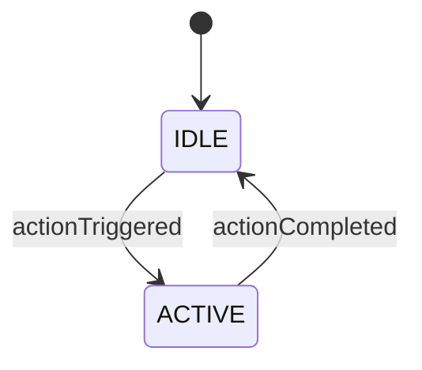

# [Subsystem Name] Subsystem

## ⚙️ Overview
[A brief, 2-3 sentence description of what this subsystem physically does on the robot.]

---

## 🔌 Hardware Mapping
| Component | Hardware Type | CAN ID / Port | CAN Bus | Notes |
| :--- | :--- | :--- | :--- | :--- |
| **[Name]** | [e.g., TalonFX] | `[ID]` | `[Bus Name]` | [e.g., Inverted, Stator limit 60A] |

---

## 🏗️ Architecture & AdvantageKit
This subsystem strictly follows the AdvantageKit 3-file IO pattern.
* **Interface:** `[SubsystemName]IO.java`
* **Real Hardware:** `[SubsystemName]IOHardware.java`
* **Simulation:** `[SubsystemName]IOSim.java`
* **Mechanism Notes:** [State whether this uses YAMS or standard WPILib logic]

---

## 🔄 State Machine & Flow
[Inject Mermaid diagram illustrating subsystem states, interactions, or data flow.]

---

## 🎮 Command API (Public Methods)
These are the primary Command factories exposed to RobotContainer.java for button bindings:
* **defaultCommand():** [Description of what the default state/action is.]
* **[action]Command():** [Description of specific action.]

---

## 🧪 Testing & Simulation Requirements
* **JUnit Tests:** Covered in Mock[SubsystemName]Test.java. Verifies [insert key logic tested].
* **Sim Behavior:** In simulation, this subsystem behaves by [describe how the sim fakes the data].

---

## Any Additional Notes
* [Include any other relevant information, such as known issues, future improvements, or special considerations for operators or maintainers.]
