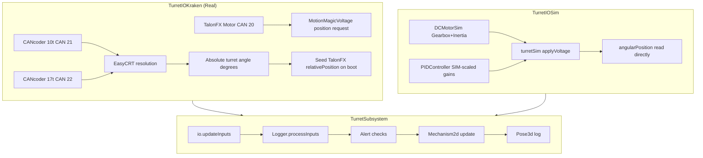
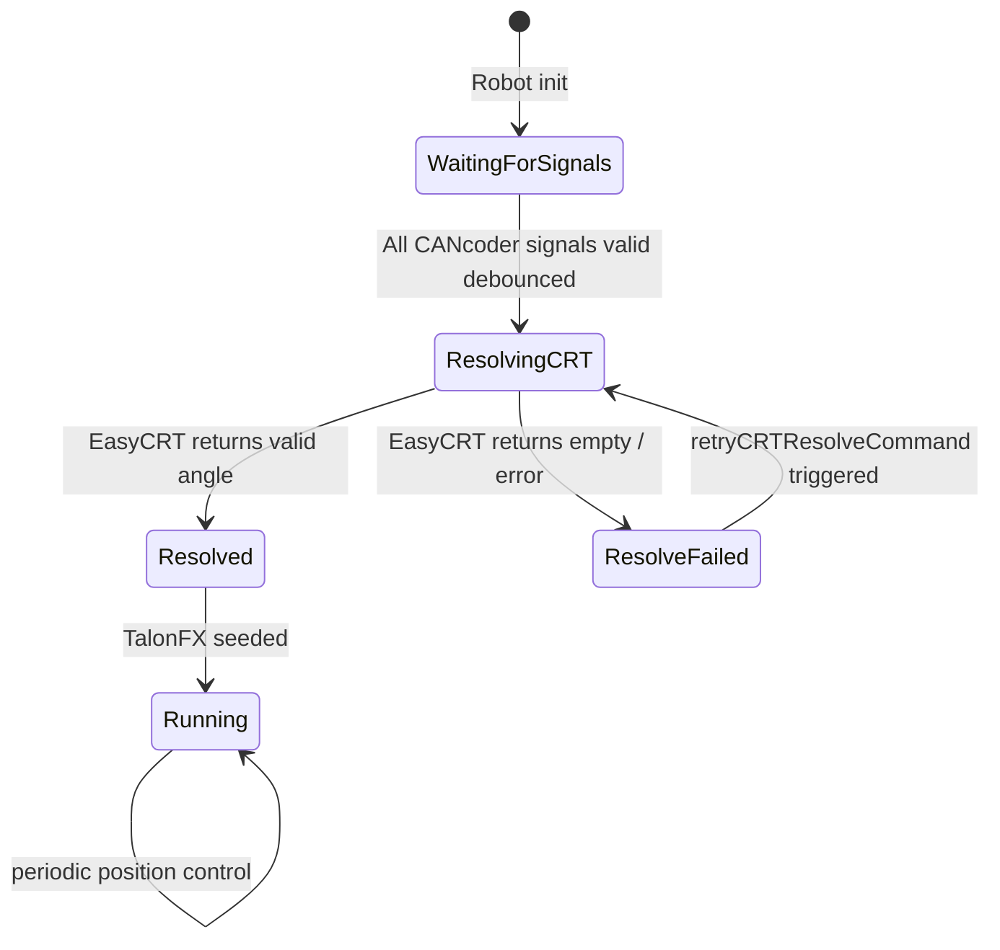
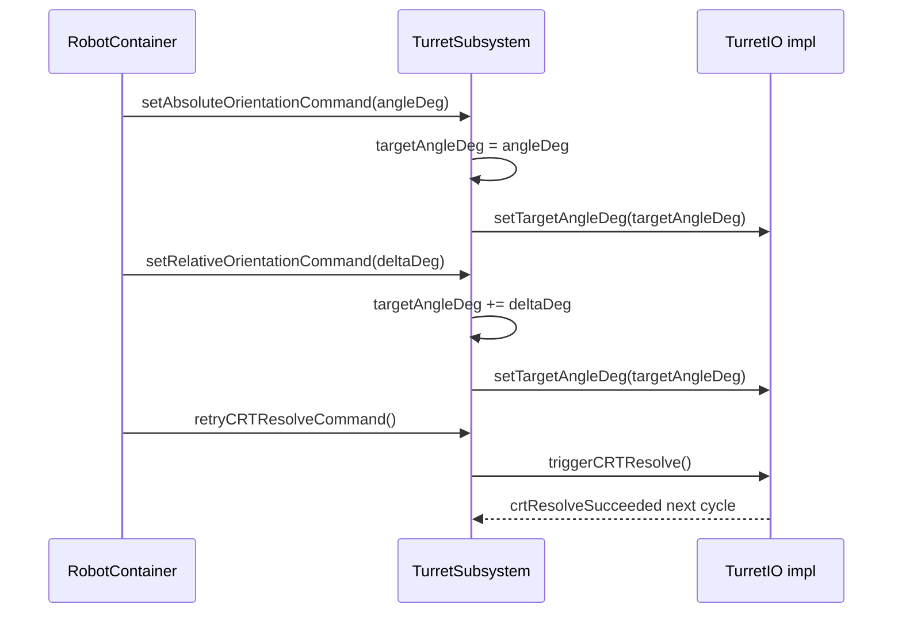
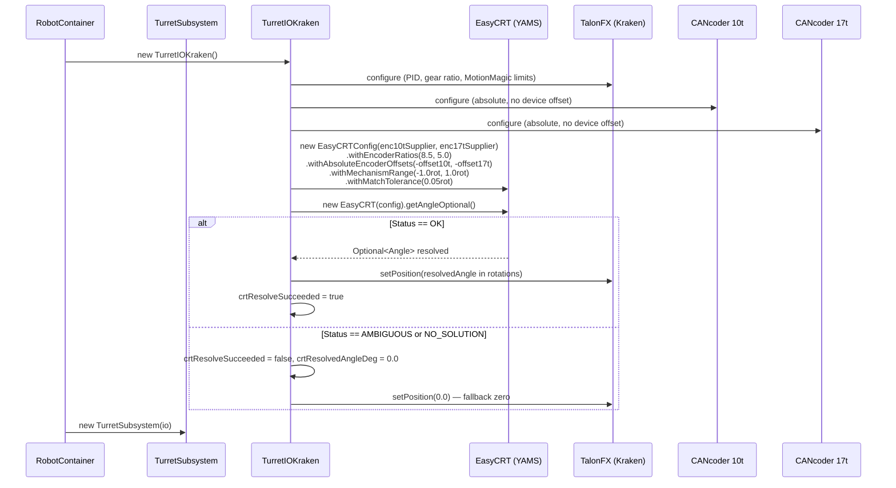
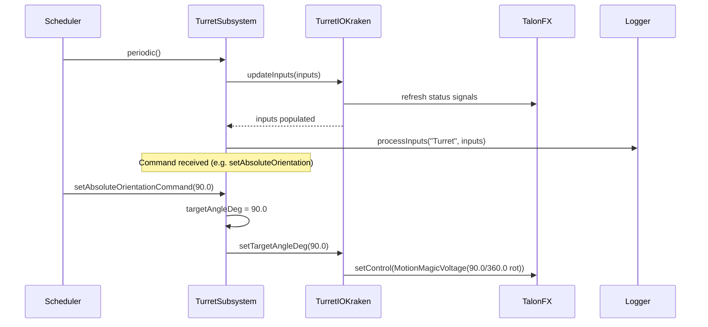
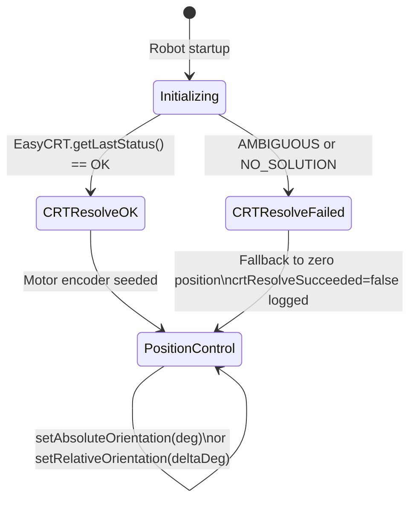

# Turret Subsystem — Implementation, Fixes & Enhancements

## Overview

Fix five critical bugs in the existing `TurretSubsystem` IO stack and add competition-ready features including `Mechanism2d` AdvantageScope 2D logging, `Pose3d` 3D logging, and a `retryCRTResolveCommand()` API.

The turret uses a Kraken X60 driving an 85-tooth main gear through a two-stage gear reduction. Absolute position is resolved via two CANcoders on coprime pinions (10t and 17t) using YAMS `EasyCRT` — giving a CRT unique coverage of 720°.

---

## Flow

### Data Flow



### State Diagram — Boot / CRT Resolve



### Command API Sequence



---

## Requirements

### Functional
- `getOrientationDeg()` returns current measured turret angle in degrees.
- `setAbsoluteOrientationCommand(double angleDeg)` moves turret to an absolute angle.
- `setRelativeOrientationCommand(double deltaDeg)` offsets current target by deltaDeg.
- `retryCRTResolveCommand()` re-triggers CRT resolution without rebooting.
- `targetAngleDeg` is seeded from the CRT-resolved angle on first successful boot resolve.
- AdvantageScope 2D visualization via `Mechanism2d` logged to `Turret/Mechanism2d`.
- AdvantageScope 3D visualization via `Pose3d` logged under `Turret/Pose3d`.

### Bug Fixes
1. **Sim double gear-ratio:** `TurretIOSim.updateInputs` must NOT divide `getAngularPositionRad()` by `MOTOR_TO_TURRET_RATIO` — `DCMotorSim` with the ratio already outputs mechanism-side values.
2. **Sim PID scaling:** Use `SIM_kP / SIM_kI / SIM_kD` constants (voltage-domain tuned) instead of hardware gains.
3. **Boot race condition:** `TurretIOKraken` must call `BaseStatusSignal.waitForAll(0.25, ...)` for both CANcoder signals before calling `EasyCRT`.
4. **Uninitialized target angle:** On first `crtResolveSucceeded`, set `targetAngleDeg = inputs.crtResolvedAngleDeg`.
5. **Missing visualization:** Add `Mechanism2d` ligament angle logging and `Pose3d` yaw logging in `TurretSubsystem.periodic()`.

---

## Implementation Steps

### `Constants.java` — `TurretConstants`
Add:
```java
public static final double SIM_kP = 8.0;
public static final double SIM_kI = 0.0;
public static final double SIM_kD = 0.0;
public static final double MECHANISM_LENGTH_METERS = 0.3;
public static final Translation3d POSE3D_OFFSET = new Translation3d(0.0, 0.0, 0.25);
```

### `TurretIO.java`
Add:
```java
public default void triggerCRTResolve() {}
```

### `TurretIOKraken.java`
- Add `private boolean needsCRTResolve = false;` field.
- After constructing CANcoders, call `BaseStatusSignal.waitForAll(0.25, absolutePosition10t, absolutePosition17t)` before EasyCRT.
- If not OK, set `needsCRTResolve = true` instead of running CRT.
- In `updateInputs`, if `needsCRTResolve`, retry EasyCRT when signals are fresh.
- Implement `triggerCRTResolve()` to set `needsCRTResolve = true` and `motorSeeded = false`.

### `TurretIOSim.java`
- Change `new PIDController(TurretConstants.kP, TurretConstants.kI, TurretConstants.kD)` to use `SIM_kP/kI/kD`.
- In `updateInputs`, change position read from `turretSim.getAngularPositionRad() / MOTOR_TO_TURRET_RATIO * (180/PI)` to `turretSim.getAngularPositionRad() * (180/PI)`.
- In `updateInputs`, change velocity read similarly (no ratio division).
- Implement `triggerCRTResolve()` to set `inputs.crtResolveSucceeded = true` with current sim position.

### `TurretSubsystem.java`
- Add `private boolean targetSeeded = false;` field.
- In `periodic()`, after `Logger.processInputs`: if `!targetSeeded && inputs.crtResolveSucceeded` → `targetAngleDeg = inputs.crtResolvedAngleDeg; targetSeeded = true;`
- Add Mechanism2d fields and update in periodic.
- Add Pose3d logging in periodic.
- Add `retryCRTResolveCommand()` method.
- Add `getOrientationDeg()` method returning `inputs.turretPositionDeg`.

---

## Testing

| Test | Verification Criteria |
|------|----------------------|
| Sim position reads correctly | `turretPositionDeg` changes with setpoint without ratio double-count |
| Sim PID stability | Step response settles without oscillation with SIM_kP gains |
| CRT seed on boot | `targetAngleDeg` equals `crtResolvedAngleDeg` after first resolve |
| Relative command | `setRelativeOrientationCommand(+45)` from 90° yields target of 135° |
| Retry CRT command | `retryCRTResolveCommand()` clears `targetSeeded`, re-runs IO resolve |
| Mechanism2d logging | AdvantageScope shows Mechanism2d entry updating with turret angle |
| Pose3d logging | AdvantageScope 3D shows turret yaw marker rotating with angle |

---

## Tech Stack

| Library | Version | Usage |
|---------|---------|-------|
| WPILib | 2026.2.1 | `Mechanism2d`, `DCMotorSim`, `PIDController`, `Pose3d`, `Rotation3d`, `Translation3d` |
| AdvantageKit | akit-autolog | `@AutoLog`, `Logger.processInputs`, `Logger.recordOutput` |
| CTRE Phoenix 6 | vendordep | `TalonFX`, `CANcoder`, `BaseStatusSignal.waitForAll`, `MotionMagicVoltage` |
| YAMS EasyCRT | vendordep | Chinese Remainder Theorem absolute position resolver |

## Overview

Implement a new `TurretSubsystem` for the 2026 competition robot. The turret uses a Kraken X60 motor with a two-stage gear reduction, and two CANcoders on coprime pinions (10t and 17t) for absolute position resolution via the Chinese Remainder Theorem (CRT). YAMS `EasyCRT` is used once at startup to resolve the absolute turret angle, which is then seeded into the Kraken's internal encoder for closed-loop position control. The subsystem follows the AdvantageKit IO abstraction pattern already used in the Drive subsystem.

---

## Flow

### Startup Initialization (CRT Resolve)



### Normal Operation (Periodic Loop)



### State Diagram



---

## Requirements

1. **Absolute position resolution** — use YAMS `EasyCRT` once at startup to determine turret angle from two CANcoders
2. **Encoder seeding** — seed Kraken internal encoder after CRT resolve; all subsequent tracking via motor encoder only
3. **Absolute orientation command** — `setAbsoluteOrientationCommand(double deg)` sets turret to a specific angle
4. **Relative orientation command** — `setRelativeOrientationCommand(double deltaDeg)` adds delta to current *commanded* position, not measured position
5. **Current position getter** — `getOrientationDeg()` returns current measured turret angle
6. **Continuous rotation** — no mechanical hard stops; design supports full 360°+ travel
7. **Configurable soft limits** — `SOFT_LIMIT_ENABLED` constant for future use; defaults to disabled
8. **Speed limiting** — `MotionMagicCruiseVelocity` set from `MAX_VELOCITY_DEG_PER_SEC`
9. **CRT failure fallback** — on `AMBIGUOUS` or `NO_SOLUTION`, log error, zero position fallback, `crtResolveSucceeded = false` published via AdvantageKit
10. **AdvantageKit IO pattern** — `TurretIO` interface with `@AutoLog` inputs, `TurretIOKraken` hardware impl, `TurretIOSim` simulation impl
11. **YAMS already vendordep'd** — `vendordeps/yams.json` exists at version 2026.2.23, no new dep needed

---

## Implementation Steps

### 1. `Constants.java` — Add `TurretConstants` inner class

**File:** `src/main/java/frc/robot/Constants.java`

Add a `public static final class TurretConstants` with:

| Constant | Value | Notes |
|----------|-------|-------|
| `MOTOR_CAN_ID` | `20` | TODO: assign real ID |
| `CANCODER_10T_CAN_ID` | `21` | TODO: assign real ID |
| `CANCODER_17T_CAN_ID` | `22` | TODO: assign real ID |
| `MOTOR_TO_TURRET_RATIO` | `32.5833` | (46/12) × (85/10) |
| `CANCODER_10T_TO_TURRET` | `8.5` | 85/10 rotations per turret rotation |
| `CANCODER_17T_TO_TURRET` | `5.0` | 85/17 rotations per turret rotation |
| `kP` | `5.0` | TODO: tune |
| `kI` | `0.0` | TODO: tune |
| `kD` | `0.1` | TODO: tune |
| `MAX_VELOCITY_DEG_PER_SEC` | `360.0` | TODO: tune |
| `MAX_ACCEL_DEG_PER_SEC_SQ` | `720.0` | TODO: tune |
| `ZERO_OFFSET_DEG` | `0.0` | TODO: calibrate mechanical zero |
| `CRT_MATCH_TOLERANCE_ROT` | `0.05` | TODO: tune based on backlash |
| `CANCODER_10T_OFFSET_ROT` | `0.0` | TODO: set after mechanical zeroing |
| `CANCODER_17T_OFFSET_ROT` | `0.0` | TODO: set after mechanical zeroing |
| `SOFT_LIMIT_ENABLED` | `false` | Enable when hard stops are known |
| `SOFT_LIMIT_MIN_DEG` | `-180.0` | Only used if soft limits enabled |
| `SOFT_LIMIT_MAX_DEG` | `180.0` | Only used if soft limits enabled |
| `TURRET_INERTIA_KG_M2` | `0.001` | TODO: measure or estimate for sim |

---

### 2. `TurretIO.java` — IO Interface

**File:** `src/main/java/frc/robot/subsystems/turret/TurretIO.java`

```java
package frc.robot.subsystems.turret;

import org.littletonrobotics.junction.AutoLog;

public interface TurretIO {
  @AutoLog
  public static class TurretIOInputs {
    public boolean motorConnected = false;
    public boolean cancoder10tConnected = false;
    public boolean cancoder17tConnected = false;

    public double turretPositionDeg = 0.0;
    public double turretVelocityDegPerSec = 0.0;
    public double motorAppliedVolts = 0.0;
    public double motorCurrentAmps = 0.0;

    public double cancoder10tPositionRot = 0.0;
    public double cancoder17tPositionRot = 0.0;

    public boolean crtResolveSucceeded = false;
    public double crtResolvedAngleDeg = 0.0;
  }

  public default void updateInputs(TurretIOInputs inputs) {}
  public default void setTargetAngleDeg(double angleDeg) {}
}
```

---

### 3. `TurretIOKraken.java` — Hardware Implementation

**File:** `src/main/java/frc/robot/subsystems/turret/TurretIOKraken.java`

Key implementation details:

**Fields:**
- `TalonFX motor` — CAN ID from `TurretConstants.MOTOR_CAN_ID`
- `CANcoder cancoder10t` — CAN ID from `TurretConstants.CANCODER_10T_CAN_ID`
- `CANcoder cancoder17t` — CAN ID from `TurretConstants.CANCODER_17T_CAN_ID`
- `StatusSignal<Angle> motorPositionSignal, motorVelocitySignal, motorVoltageSignal, motorCurrentSignal`
- `StatusSignal<Angle> cancoder10tSignal, cancoder17tSignal`
- `Debouncer motorConnectedDebouncer, cancoder10tDebouncer, cancoder17tDebouncer` (0.5s debounce)
- `MotionMagicVoltage motionMagicRequest = new MotionMagicVoltage(0.0).withSlot(0)`
- `boolean crtResolveSucceeded = false`
- `double crtResolvedAngleDeg = 0.0`

**Constructor:**

1. Create `TalonFX motor = new TalonFX(TurretConstants.MOTOR_CAN_ID)` and `CANcoder cancoder10t, cancoder17t`

2. Configure TalonFX:
   ```
   TalonFXConfiguration config = new TalonFXConfiguration()
   config.MotorOutput.NeutralMode = NeutralModeValue.Brake
   config.Slot0.kP = TurretConstants.kP
   config.Slot0.kI = TurretConstants.kI
   config.Slot0.kD = TurretConstants.kD
   config.Feedback.SensorToMechanismRatio = TurretConstants.MOTOR_TO_TURRET_RATIO
   config.MotionMagic.MotionMagicCruiseVelocity = MAX_VELOCITY_DEG_PER_SEC / 360.0
   config.MotionMagic.MotionMagicAcceleration = MAX_ACCEL_DEG_PER_SEC_SQ / 360.0
   config.SoftwareLimitSwitch (if SOFT_LIMIT_ENABLED)
   motor.getConfigurator().apply(config)
   ```

3. Configure both CANcoders (absolute, no device-level magnet offset — offsets handled in EasyCRTConfig):
   ```
   CANcoderConfiguration ccConfig = new CANcoderConfiguration()
   ccConfig.MagnetSensor.AbsoluteSensorDiscontinuityPoint = 1.0
   cancoder.getConfigurator().apply(ccConfig)
   ```

4. Cache status signals and set 50 Hz update frequency

5. Resolve CRT:
   ```java
   Supplier<Angle> enc10t = () -> {
     cancoder10t.getAbsolutePosition().refresh();
     return cancoder10t.getAbsolutePosition().getValue();
   };
   Supplier<Angle> enc17t = () -> {
     cancoder17t.getAbsolutePosition().refresh();
     return cancoder17t.getAbsolutePosition().getValue();
   };

   EasyCRTConfig crtConfig = new EasyCRTConfig(enc10t, enc17t)
     .withEncoderRatios(TurretConstants.CANCODER_10T_TO_TURRET, TurretConstants.CANCODER_17T_TO_TURRET)
     .withAbsoluteEncoderOffsets(
         Rotations.of(-TurretConstants.CANCODER_10T_OFFSET_ROT),
         Rotations.of(-TurretConstants.CANCODER_17T_OFFSET_ROT))
     .withMechanismRange(Rotations.of(-1.0), Rotations.of(1.0))
     .withMatchTolerance(Rotations.of(TurretConstants.CRT_MATCH_TOLERANCE_ROT))
     .withAbsoluteEncoderInversions(false, false);

   EasyCRT crt = new EasyCRT(crtConfig);
   Optional<Angle> resolved = crt.getAngleOptional();

   if (crt.getLastStatus() == CRTStatus.OK && resolved.isPresent()) {
     double angleDeg = resolved.get().in(Degrees);
     motor.setPosition(angleDeg / 360.0);
     crtResolveSucceeded = true;
     crtResolvedAngleDeg = angleDeg;
   } else {
     DriverStation.reportError("Turret CRT resolve failed: " + crt.getLastStatus(), false);
     motor.setPosition(0.0);
     crtResolveSucceeded = false;
     crtResolvedAngleDeg = 0.0;
   }
   ```

**`updateInputs()`:**
```
BaseStatusSignal.refreshAll(all signals)
inputs.motorConnected = motorConnectedDebouncer.calculate(BaseStatusSignal.isAllGood(...))
inputs.cancoder10tConnected = ...
inputs.cancoder17tConnected = ...
inputs.turretPositionDeg = motorPositionSignal.getValueAsDouble() * 360.0
inputs.turretVelocityDegPerSec = motorVelocitySignal.getValueAsDouble() * 360.0
inputs.motorAppliedVolts = motorVoltageSignal.getValueAsDouble()
inputs.motorCurrentAmps = motorCurrentSignal.getValueAsDouble()
inputs.cancoder10tPositionRot = cancoder10tSignal.getValueAsDouble()
inputs.cancoder17tPositionRot = cancoder17tSignal.getValueAsDouble()
inputs.crtResolveSucceeded = crtResolveSucceeded
inputs.crtResolvedAngleDeg = crtResolvedAngleDeg
```

**`setTargetAngleDeg(double angleDeg)`:**
```
motor.setControl(motionMagicRequest.withPosition(angleDeg / 360.0))
```

---

### 4. `TurretIOSim.java` — Simulation Implementation

**File:** `src/main/java/frc/robot/subsystems/turret/TurretIOSim.java`

Uses `DCMotorSim` (WPILib) with Kraken X60 motor model (gear ratio applied). Uses a `PIDController` for position control in simulation.

```java
private static final DCMotor TURRET_GEARBOX = DCMotor.getKrakenX60Foc(1);
private final DCMotorSim turretSim = new DCMotorSim(
    LinearSystemId.createDCMotorSystem(TURRET_GEARBOX, TurretConstants.TURRET_INERTIA_KG_M2, TurretConstants.MOTOR_TO_TURRET_RATIO),
    TURRET_GEARBOX);
private final PIDController controller = new PIDController(TurretConstants.kP * 0.1, 0, 0);
// (scale kP down for sim voltage-domain)
private boolean closedLoop = false;
private double appliedVolts = 0.0;
private double targetPositionRad = 0.0;
```

Sim always reports `crtResolveSucceeded = true` and `crtResolvedAngleDeg = 0.0` (no real CRT needed in sim).

In `updateInputs()`:
- If closed loop: compute PID output from position error, clamp to ±12V
- Run `turretSim.update(0.02)`
- Populate all inputs from sim state
- `turretPositionDeg = turretSim.getAngularPositionRad() * 180.0 / Math.PI` (converted from motor position by dividing out gear ratio — or track position directly in mechanism space)

Note: `DCMotorSim` tracks position in rotor radians. Divide by `MOTOR_TO_TURRET_RATIO` to get mechanism rotations.

In `setTargetAngleDeg(double angleDeg)`:
- `closedLoop = true`
- `targetPositionRad = Math.toRadians(angleDeg) * TurretConstants.MOTOR_TO_TURRET_RATIO` (motor radians)

---

### 5. `TurretSubsystem.java` — Main Subsystem

**File:** `src/main/java/frc/robot/subsystems/turret/TurretSubsystem.java`

```java
public class TurretSubsystem extends SubsystemBase {
  private final TurretIO io;
  private final TurretIOInputsAutoLogged inputs = new TurretIOInputsAutoLogged();
  private double targetAngleDeg = 0.0;

  private final Alert motorDisconnectedAlert;
  private final Alert cancoder10tDisconnectedAlert;
  private final Alert cancoder17tDisconnectedAlert;
  private final Alert crtFailedAlert;

  public TurretSubsystem(TurretIO io) { ... }

  @Override
  public void periodic() {
    io.updateInputs(inputs);
    Logger.processInputs("Turret", inputs);

    motorDisconnectedAlert.set(!inputs.motorConnected);
    cancoder10tDisconnectedAlert.set(!inputs.cancoder10tConnected);
    cancoder17tDisconnectedAlert.set(!inputs.cancoder17tConnected);
    crtFailedAlert.set(!inputs.crtResolveSucceeded);
  }

  /** Returns measured turret angle in degrees. */
  public double getOrientationDeg() {
    return inputs.turretPositionDeg;
  }

  /** Returns the current commanded target angle in degrees. */
  public double getTargetAngleDeg() {
    return targetAngleDeg;
  }

  /** Command: go to an absolute angle (degrees). */
  public Command setAbsoluteOrientationCommand(double angleDeg) {
    return Commands.runOnce(() -> {
      targetAngleDeg = angleDeg;
      io.setTargetAngleDeg(targetAngleDeg);
    }, this);
  }

  /** Command: add a delta to current commanded angle (degrees). */
  public Command setRelativeOrientationCommand(double deltaDeg) {
    return Commands.runOnce(() -> {
      targetAngleDeg += deltaDeg;
      io.setTargetAngleDeg(targetAngleDeg);
    }, this);
  }
}
```

---

### 6. `RobotContainer.java` — Wire Up TurretSubsystem

**File:** `src/main/java/frc/robot/RobotContainer.java`

Add field:
```java
private final TurretSubsystem turret;
```

In constructor, add after drive switch/case:
```java
switch (Constants.currentMode) {
  case REAL:
    turret = new TurretSubsystem(new TurretIOKraken());
    break;
  case SIM:
    turret = new TurretSubsystem(new TurretIOSim());
    break;
  default:
    turret = new TurretSubsystem(new TurretIO() {});
    break;
}
```

---

## Testing

### Build & Runtime
- [ ] `./gradlew build` passes with zero errors
- [ ] `./gradlew simulateJava` launches without crash
- [ ] All `TurretIOInputs` fields appear in AdvantageScope under the "Turret" key

### Unit/Integration Scenarios
- [ ] **CRT resolve (success):** given known 10t and 17t encoder readings, `EasyCRT` returns correct turret angle (`crtResolveSucceeded = true`, `crtResolvedAngleDeg` matches expected)
- [ ] **CRT failure handling:** when CRT returns `AMBIGUOUS` or `NO_SOLUTION`, subsystem logs error, `crtResolveSucceeded = false`, fallback position = 0.0
- [ ] **Absolute orientation:** `setAbsoluteOrientationCommand(180.0)` sets `targetAngleDeg = 180.0` and commands motor to `0.5 rot` (180°/360°)
- [ ] **Relative orientation (positive):** `setRelativeOrientationCommand(5.0)` adds 5° to current `targetAngleDeg`
- [ ] **Relative orientation (negative):** `setRelativeOrientationCommand(-10.0)` subtracts 10° from current `targetAngleDeg`
- [ ] **Relative vs measured drift:** calling `setRelativeOrientationCommand` multiple times accumulates correctly on `targetAngleDeg`, not on sensor reading
- [ ] **Gear ratio math:** `inputs.turretPositionDeg` properly reflects mechanism degrees (motor position ÷ 32.5833 × 360°)
- [ ] **Speed limit:** `MotionMagicCruiseVelocity = MAX_VELOCITY_DEG_PER_SEC / 360.0` in TalonFX config
- [ ] **IO abstraction:** same `TurretSubsystem` class instantiated with `TurretIOKraken` and `TurretIOSim` without modification
- [ ] **Sim closed loop:** in simulation, turret position converges toward commanded target angle

---

## Tech Stack

| Component | Library | Version | Notes |
|-----------|---------|---------|-------|
| AdvantageKit | `org.littletonrobotics.akit` | from `AdvantageKit.json` | `@AutoLog`, `Logger.processInputs()` |
| CTRE Phoenix 6 | `com.ctre.phoenix6` | from `Phoenix6.json` | `TalonFX`, `CANcoder`, `MotionMagicVoltage`, `BaseStatusSignal` |
| YAMS | `yams` | `2026.2.23` | `yams.units.EasyCRT`, `yams.units.EasyCRTConfig`, `yams.units.EasyCRT.CRTStatus` — **already in vendordeps** |
| WPILib | `edu.wpi.first` | 2026 | `SubsystemBase`, `Commands`, `Alert`, `DCMotorSim`, `PIDController` |

### Key Classes Used
- `yams.units.EasyCRT` / `EasyCRTConfig` — CRT resolver
- `com.ctre.phoenix6.hardware.TalonFX` — Kraken X60 motor controller
- `com.ctre.phoenix6.hardware.CANcoder` — absolute encoder
- `com.ctre.phoenix6.controls.MotionMagicVoltage` — position control with velocity limiting
- `com.ctre.phoenix6.BaseStatusSignal` — signal refresh + connectivity checking
- `edu.wpi.first.math.filter.Debouncer` — connectivity debouncing
- `edu.wpi.first.wpilibj.simulation.DCMotorSim` — turret physics simulation
- `org.littletonrobotics.junction.Logger` — AdvantageKit logging
- `org.littletonrobotics.junction.AutoLog` — auto-generated `TurretIOInputsAutoLogged`
