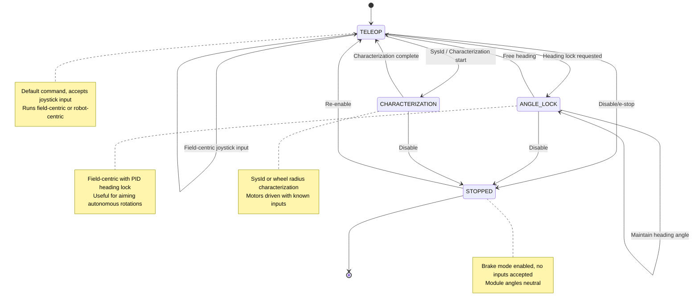
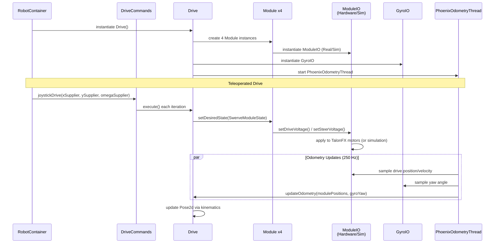

# Drive (Swerve) Subsystem

## ⚙️ Overview
The Drive subsystem is a 4-module swerve drivetrain powered by the AdvantageKit Swerve Template with CTRE TunerX-generated hardware constants. It supports field-centric and robot-centric driving modes, high-frequency Phoenix odometry (250 Hz) for accurate pose estimation, and full simulation support via ModuleIOSim. Each swerve module features independently controlled drive and steer motors with absolute CANcoder feedback.

## 🔌 Hardware Mapping
| Component | Hardware Type | CAN ID Source | CAN Bus | Notes |
|-----------|---------------|---------------|---------|-------|
| FL Drive Motor | TalonFX (Kraken X60) | TunerConstants.kFrontLeft | "rio" or CANivore | Phoenix 6, FOC enabled |
| FL Steer Motor | TalonFX (Kraken X60) | TunerConstants.kFrontLeft | "rio" or CANivore | Phoenix 6 |
| FL CANcoder | CANcoder | TunerConstants.kFrontLeft | Same as drive | Absolute steer encoder |
| FR Drive Motor | TalonFX (Kraken X60) | TunerConstants.kFrontRight | "rio" or CANivore | Phoenix 6, FOC enabled |
| FR Steer Motor | TalonFX (Kraken X60) | TunerConstants.kFrontRight | "rio" or CANivore | Phoenix 6 |
| FR CANcoder | CANcoder | TunerConstants.kFrontRight | Same as drive | Absolute steer encoder |
| BL Drive Motor | TalonFX (Kraken X60) | TunerConstants.kBackLeft | "rio" or CANivore | Phoenix 6, FOC enabled |
| BL Steer Motor | TalonFX (Kraken X60) | TunerConstants.kBackLeft | "rio" or CANivore | Phoenix 6 |
| BL CANcoder | CANcoder | TunerConstants.kBackLeft | Same as drive | Absolute steer encoder |
| BR Drive Motor | TalonFX (Kraken X60) | TunerConstants.kBackRight | "rio" or CANivore | Phoenix 6, FOC enabled |
| BR Steer Motor | TalonFX (Kraken X60) | TunerConstants.kBackRight | "rio" or CANivore | Phoenix 6 |
| BR CANcoder | CANcoder | TunerConstants.kBackRight | Same as drive | Absolute steer encoder |
| Gyro | Pigeon2 (primary) / NavX (secondary) | TunerConstants | CANivore / SPI | Primary: GyroIOPigeon2, Secondary: GyroIONavX |

**CAN IDs:** All CAN device IDs are defined in `TunerConstants.java` (auto-generated by TunerX). Refer to that file for exact ID assignments for your specific robot hardware.

## 🏗️ Architecture & AdvantageKit
The subsystem uses the AdvantageKit IO pattern to support real hardware, alternate hardware implementations, and simulation through polymorphic interfaces.

### Gyro Architecture
- **Interface:** `GyroIO.java` — defines gyro sensor contract (yaw rate, yaw angle, connected status)
- **Real Implementations:**
  - `GyroIOPigeon2.java` — Pigeon2 IMU via Phoenix 6 over CANivore
  - `GyroIONavX.java` — NavX via SPI (fallback)
- **Simulation:** No separate sim file; gyro state is derived from calculated swerve module states

### Module Architecture (per module, 4 instantiated)
- **Interface:** `ModuleIO.java` — defines drive/steer motor control and feedback contract
- **Real Implementations:**
  - `ModuleIOTalonFX.java` — Kraken X60 or Falcon 500 motors via Phoenix 6
  - `ModuleIOTalonFXS.java` — TalonFXS motors (alternate hardware option)
- **Simulation:** `ModuleIOSim.java` — WPILib DCMotorSim for both drive and steer motors

### Top-Level Subsystem Files
- **`Drive.java`** — Main WPILib subsystem; orchestrates all 4 modules + gyro, runs inverse/forward kinematics, maintains odometry
- **`Module.java`** — Encapsulates per-module logic; runs the assigned ModuleIO instance and computes module states for swerve calculations
- **`PhoenixOdometryThread.java`** — Dedicated high-frequency background thread (250 Hz) that samples Phoenix motor signals for precise odometry updates, improving position tracking accuracy

### Constants & TunerX
- **`TunerConstants.java`** (in `generated/` folder) — Auto-generated by TunerX containing physical robot constants:
  - Drive motor gear ratio
  - Steer motor gear ratio
  - Wheel radius
  - CAN IDs for all drive, steer, and CANcoder devices
  - Wheel base and track width
  - Gyro CAN ID / SPI port

## 🔄 State Machine & Flow

### Drive Subsystem State Machine

### Data Flow & Initialization Sequence

## 🎮 Command API (Public Methods)
The Drive subsystem exposes driving and characterization commands through the `DriveCommands` factory class:

### Teleoperated Driving
- **`joystickDrive(drive, xSupplier, ySupplier, omegaSupplier)`**  
  Field-centric teleoperated drive with joystick inputs. Robot moves relative to field orientation.

- **`joystickDriveAtAngle(drive, xSupplier, ySupplier, rotationSupplier)`**  
  Field-centric drive with PID-maintained heading angle. Useful for consistent autonomous-like rotations during teleop.

### Characterization & Testing
- **`wheelRadiusCharacterization(drive)`**  
  Characterization routine to determine actual wheel radius by driving in a circle and measuring encoder counts.

- **`feedforwardCharacterization(drive)`**  
  SysId-style feedforward characterization to identify drive motor kS and kV constants.

- **`sysIdQuasistatic(drive, direction)`**  
  SysId quasistatic test (slow voltage ramp) for system identification in specified direction (forward/backward).

- **`sysIdDynamic(drive, direction)`**  
  SysId dynamic test (fast voltage step) for system identification in specified direction (forward/backward).

## 🧪 Testing & Simulation Requirements

### Simulation Behavior
- **ModuleIOSim.java** simulates drive and steer motors using WPILib's `DCMotorSim`, accurately modeling motor dynamics with configurable moment of inertia
- **Gyro simulation** derives yaw angle and yaw rate from the calculated swerve module states (no separate GyroIOSim required)
- **PhoenixOdometryThread** continues to run in simulation, sampling simulated motor data for consistent odometry behavior

### Unit Testing Strategy
- **Mock Implementations:** Create `MockModuleIO` and `MockGyroIO` for unit tests to isolate Drive.java kinematics and odometry logic
- **Test Coverage:**
  - Forward kinematics: translation and rotation inputs → module states
  - Inverse kinematics: desired chassis velocity → module velocities
  - Odometry updates: module positions + gyro yaw → Pose2d
  - State transitions (TELEOP → ANGLE_LOCK, etc.)
- **No Real Hardware in Tests:** Ensure no direct instantiation of `TalonFX`, `CANcoder`, or `Pigeon2` in test classes; always use IO interfaces

### Simulation Testing
- Verify module states reach target angles and speeds in sim
- Confirm odometry convergence with simulated wheel slippage
- Test command transitions and timeout behavior in sim mode

## 📋 Additional Notes
- **CAN Bus Configuration:** Confirm CANivore or RIO CAN bus is properly assigned in TunerConstants.java. Verify all device CAN IDs are unique and within valid range
- **Wheel Reference Frame:** Positive anglular velocity = counterclockwise (standard WPILib convention); positive drive voltage = wheel forward
- **Phoenix 6 Requirements:** Ensure Phoenix Framework 6.1+ is installed and TalonFX firmware is up-to-date
- **Odometry Thread Priority:** PhoenixOdometryThread runs at 250 Hz; do not add blocking operations to this thread
- **Field Orientation:** Use `Pose2d` and `Rotation2d` from WPILib; field-centric drive rotates chassis based on gyro yaw relative to field zero (blue alliance alliance wall)
