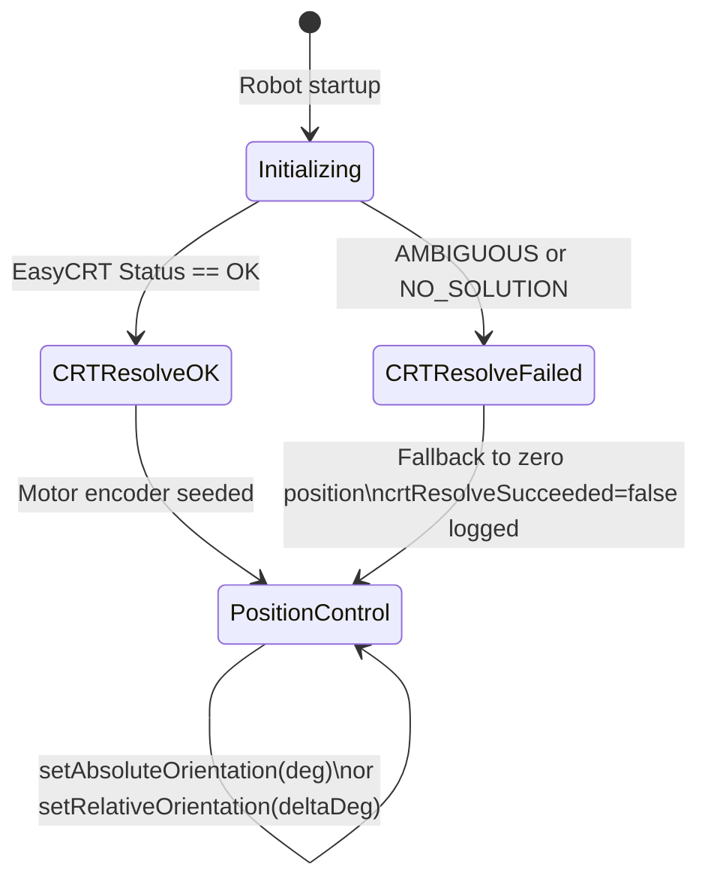

# Turret Subsystem

## ⚙️ Overview
The Turret subsystem provides absolute orientation control for the robot's scoring mechanism. It features a continuous-rotation turret driven by a Kraken X60 motor with a high-reduction gearbox. The system uses a dual-CANcoder "Chinese Remainder Theorem" (CRT) setup to resolve its absolute position at startup, allowing for precise heading control without the need for manual zeroing or limit switches.

---

## 🔌 Hardware Mapping
| Component | Hardware Type | CAN ID / Port | CAN Bus | Notes |
| :--- | :--- | :--- | :--- | :--- |
| **Turret Motor** | Kraken X60 (TalonFX) | `20` | `rio` | 32.5833:1 Reduction, MotionMagic control |
| **CANcoder 10t** | CANcoder | `21` | `rio` | 10-tooth pinion (8.5:1 ratio to turret) |
| **CANcoder 17t** | CANcoder | `22` | `rio` | 17-tooth pinion (5.0:1 ratio to turret) |

*Note: CAN IDs are currently placeholders and must be assigned via Phoenix Tuner X.*

---

## 🏗️ Architecture & AdvantageKit
This subsystem strictly follows the AdvantageKit 3-file IO pattern for hardware abstraction and log replay.
* **Interface:** [TurretIO.java](src/main/java/frc/robot/subsystems/turret/TurretIO.java)
* **Real Hardware:** [TurretIOKraken.java](src/main/java/frc/robot/subsystems/turret/TurretIOKraken.java)
* **Simulation:** [TurretIOSim.java](src/main/java/frc/robot/subsystems/turret/TurretIOSim.java)

### CRT Initialization Flow
The turret uses the **YAMS EasyCRT** library (v2026.2.23) to resolve its absolute angle at startup.
1.  **Dual Sensors:** Two CANcoders are mounted on coprime pinions (10-tooth and 17-tooth).
2.  **Resolution:** Because the pinions have different gear ratios to the turret, their combined absolute positions uniqueley identify the turret's position over a 720° (2 rotation) range.
3.  **Seeding:** The resolved angle is used to seed the Kraken's internal rotor position. All subsequent tracking is done via the motor's high-resolution integrated encoder.
4.  **Fallback:** If CRT fails (e.g., `AMBIGUOUS` or `NO_SOLUTION`), the subsystem defaults to $0^\circ$ and raises a dashboard alert.

---

## 🔄 State Machine & Flow

---

## 🎮 Command API (Public Methods)
These are the primary Command factories exposed to `RobotContainer.java`:
* **setAbsoluteOrientationCommand(double angleDeg):** Rotates the turret to a specific angle in degrees relative to the robot's forward heading.
* **setRelativeOrientationCommand(double deltaDeg):** Adjusts the turret's target by a specific amount relative to its *current commanded* target.

---

## 🧪 Testing & Simulation Requirements
* **Simulation Behavior:** The `TurretIOSim` uses a `DCMotorSim` with a Kraken X60 FOC model and a WPILib `PIDController` to approximate the MotionMagic behavior of the real hardware.
* **Verification:** Use `./gradlew simulateJava` to verify turret motion in the AdvantageScope 3D visualizer.

---

## 📝 Additional Notes
* **Gear Ratios:**
    * Motor-to-Turret: $32.5833:1$ $((\frac{46}{12}) \times (\frac{85}{10}))$
    * 10t CANcoder: $8.5$ rotations per turret rotation.
    * 17t CANcoder: $5.0$ rotations per turret rotation.
* **Control Mode:** Uses `MotionMagicVoltage` for smooth, velocity-limited transitions.
* **Soft Limits:** Currently defined in `Constants.java` but disabled (`SOFT_LIMIT_ENABLED = false`) until mechanical ranges are finalized.
